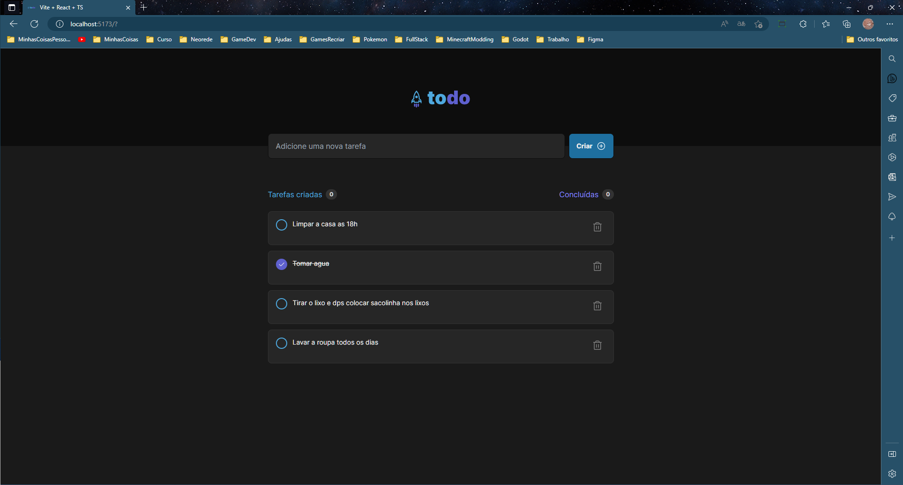
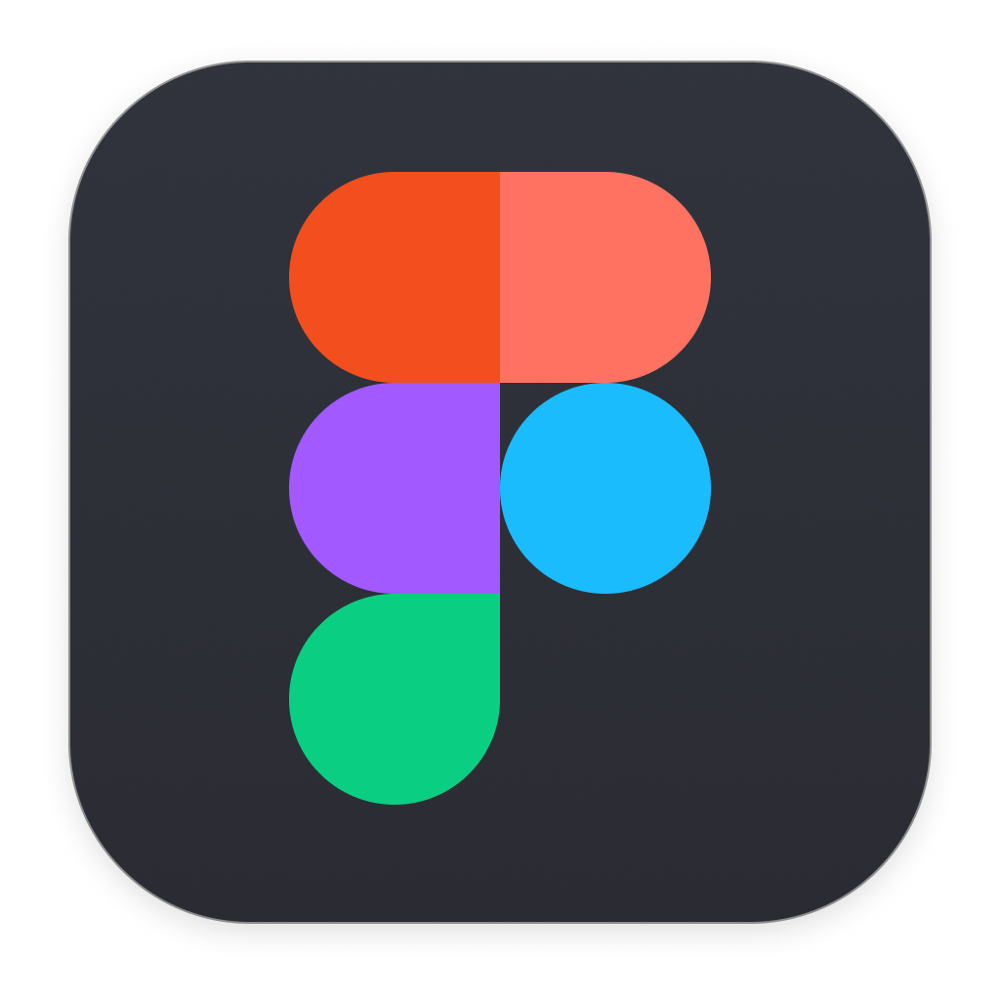

# Desafio Ignite Rocketseat 

Nese desafio aprendi muita coisa, utilizamos os conceitos básicos do React onde desenvolvendo do
zero um simples todoList com opções de criar e apagar um item da lista. No fim eu implementei ainda
o localStorage para poder armazenar as notas...

 

&nbsp;

## To-Do List

### ⚒️ Nesse projeto eu utilizei ⚒️

- Vite
- ReactJS
- Tailwindcss
- Typescript
- Local Storage
- Phosphor-React

 

&nbsp;

Feito com amor por Gabriel Gesser

